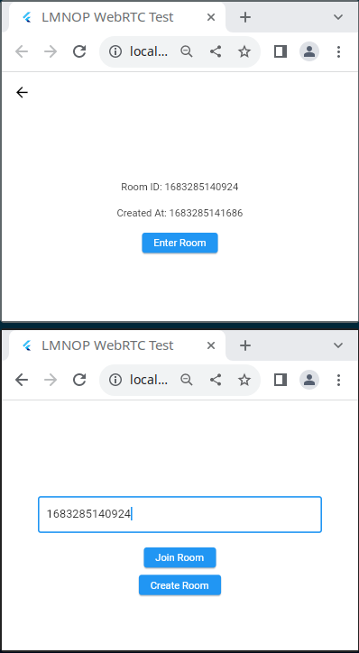
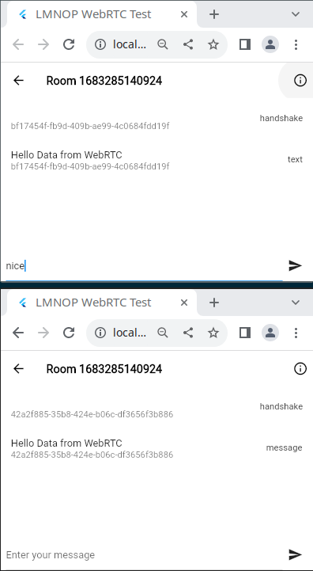

# WebRTC Mesh GC

An implementation of a simple WebRTC mesh network with garbage collection.
The app features a simple group chat room where multiple users can send messages to each other.

## Features

- [x] WebRTC mesh network
- [x] Garbage collection (automatic peer removal)
- [x] Extensible Signalling API
- [x] Multiple Chat rooms
- [x] Publish to pub.dev
- [x] Refactor to use the package
- [ ] Secure handshake
- [ ] More Documentation?

## Architecture

This is a high level overview of the architecture of the app.

## Showcase

Click to expand

    
<h2><i>Room</i></h2>

    

     
     
    
<h2><i>Chat</i></h2>

    

